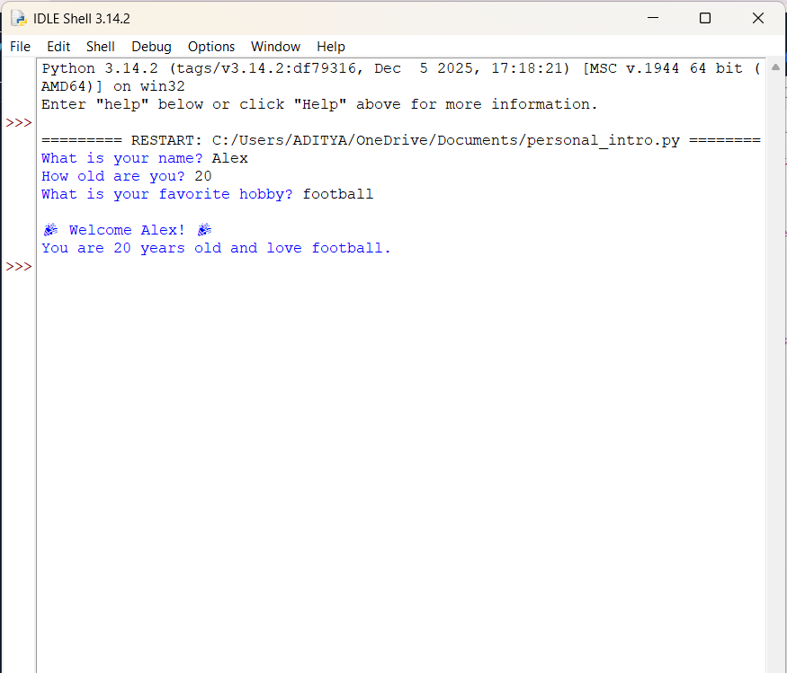

# Personal Introduction Program

## Project Overview
This project is a Python-based interactive script designed to introduce a user. Its goal is to demonstrate basic Input/Output (I/O) operations by capturing user data (name, age, and hobby) and displaying it back in a friendly, formatted welcome message.

## Setup Instructions
1. **Install Python:** Ensure Python 3.x is installed on your system.
2. **Download Files:** Save `personal_intro.py` and `requirements.txt` in the same folder.
3. **Run the Program:**
   - Open your terminal or command prompt.
   - Navigate to the project folder.
   - Run the command: `python personal_intro.py`

## Code Structure
The project directory contains the following files:
- `personal_intro.py`: The main script containing the logic for input collection and message display.
- `requirements.txt`: specificies dependencies (none required for this version).
- `README.md`: Project documentation and setup guide.
- `screenshot.png`: Visual evidence of the program running.

## Technical Details
- **Variables:** Used to store dynamic user data (`name`, `age`, `hobby`).
- **Input Function:** `input()` is used to pause the program and wait for the user to type information via the keyboard.
- **Output:** `print()` is used to display text to the console.
- **String Formatting:** Python **f-strings** (formatted string literals) are used to embed the variables directly into the welcome message strings for clean, readable code.

## Visual Documentation
Below is a screenshot demonstrating the program functionality and sample output:

## Testing Evidence
The program was tested with the following test case:
- **Input Name:** Alex
- **Input Age:** 20
- **Input Hobby:** Football
- **Result:** The program correctly printed "🎉 Welcome Alex! 🎉" and "You are 20 years old and love Football." without errors.

## What I Learned
Through this project, I learned how to:
1. Set up a Python development environment.
2. Use variables to store and manipulate user data.
3. Implement `input()` and `print()` functions for basic interactivity.
4. Format strings dynamically using f-strings to create user-friendly output.
